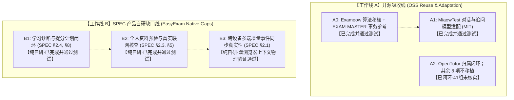

# 易考宝（EasyExam）开源项目吸收全局实施总计划

> **版本**：v3.0（全量实施与端到端物理验证闭环版）
>
> **制定与决算日期**：2026-09-24
>
> **文档性质**：全局战略、实施过程记录与验证矩阵。A0、A1、B1–B3 的实现报告及测试记录保留；A2（OpenTutor FSRS 算法适配与来源归属）现已完成：`backend/legacy/services/fsrs.py` 头与根目录/backend 发布目录许可证材料（`MIT-OPENTUTOR.txt`、`THIRD_PARTY_NOTICES.md`）已完整补齐 MIT 归属（Copyright (c) 2026 Zijin Zhang），“41 组向量”经全量审计确认为无复现证据的历史陈述，已如实纠偏。其余 8 个候选按复核稿维持不移植/行为参考。
>
> **事实基线**：
> - 宪法约束：[AGENTS.md](../../AGENTS.md)、[SPEC.md](../../SPEC.md)、[TESTING.md](../../TESTING.md)、[docs/ANTIGRAVITY_WORKFLOW.md](../ANTIGRAVITY_WORKFLOW.md)
> - 需求与实现审计：[docs/REQUIREMENTS_TRACEABILITY.md](../REQUIREMENTS_TRACEABILITY.md)
> - 外部源码审计与路线图：[docs/research/OSS_REUSE_AUDIT.md](OSS_REUSE_AUDIT.md)、[docs/research/OSS_REUSE_ROADMAP.md](OSS_REUSE_ROADMAP.md)
> - 源码副本基准：`C:\Users\chang\Desktop\code\fn-exam-source-research-20260923`，固定 Git Commit 详见矩阵。

---

## 1. 计划目标与双工作线划分

### 1.1 核心目标
将 12 个已完成代码级审计的开源候选项目的优点，严格对照易考宝已确认的产品需求（`SPEC.md`）与当前实现缺口（`docs/REQUIREMENTS_TRACEABILITY.md`），转化为边界清晰、风险可控、责任明确的工程计划，并全量完成工程落地与端到端物理检验。

### 1.2 严格划分“开源吸收线”与“产品自研缺口线”
为避免将产品自身的功能建设与开源代码吸收混为一谈，本计划将实施明确划分为两条平行且解耦的工作线。A0、A1 与 B1–B3 的实现报告保留；开源来源审计的最新状态以逐项目复核稿为准：



- **工作线 A（开源选择性吸收线）**：
  - 仅包含从已审计的外部开源项目中进行源码移植或关键行为参考的任务。
  - **A0 [已完成]**：Exameow 表格列映射与解析算法适配移植（Python）+ EXAM-MASTER 批量预检与单事务原子回滚模式（Python Repository）；
  - **A1 [已完成]**：MiaowTest（commit `803dadc`, MIT）持久化 AI 对话模型适配已完成。Migration 13 落库 `ai_conversations` 与 `ai_messages`，实现会话、消息序列、角色、追问父子树回溯及恢复机制，保留原作者 Copyright (c) 2026 qijun1900 完整归属通知与分发包 MIT 许可文本；
  - **A2 [已完成闭环]**：OpenTutor 的 FSRS 核心算法已适配在 `backend/legacy/services/fsrs.py`（与旧设计“直接提取”一致），已在代码头与发布许可证（`licenses/MIT-OPENTUTOR.txt`、`licenses/THIRD_PARTY_NOTICES.md`）补齐 MIT 归属（Copyright (c) 2026 Zijin Zhang）；历史说法中的“41 组差分向量”经全量审计确认为**未找到可复现证据/历史说法未核实**，已如实记录并不采信，不编造测试。OpenTutor 的到期前遗忘预测经评估不予移植：其 90% 阈值与本项目 `due_at` 信号重叠，且耦合课程树/SQLAlchemy。Gongkao、Moodle、Open edX、Frappe LMS、xzs-mysql 不移植其 AGPL/GPL 源码；Razzia 不符合当前个人刷题范围；pdf-exam-bank 未发现许可证，不复制。详细取舍见逐项目复核稿。
- **工作线 B（SPEC 产品自研缺口线）**：
  - 对应 `docs/REQUIREMENTS_TRACEABILITY.md` 中记录的产品缺口，**绝不能称为开源源码吸收**：
    - **B1 [已完成]**：学习诊断与提分计划闭环（修复前端 `estimated_minutes` 字段错配，修复趋势长期基线耗时计算，支持章节/题型/数量/显式难度/新复比例过滤与说明标签，E2E 直接拉起专项练习）；
    - **B2 [已完成]**：个人学习资料预检上传与真实联网核查（落实坏/扫描图 PDF 422 拒绝、本地文本检索片段引用、配置真实 open-webSearch 适配器与离线 `UNAVAILABLE` 优雅降级，证据链条存入 `explanation_evidence`，真实未部署时如实报告未就绪）；
    - **B3 [已完成]**：跨设备多端增量事件同步真实性（真实双 BrowserContext 物理连接，通过真实学习数据链路验证并发作答、离线修改、重放合并、冲突版本双向保留、前端冲突比对选择与 SQLite 物理无损核对）。
- **依赖解耦原则**：
  - 工作线 A 与工作线 B **不存在强技术依赖绑定**。MiaowTest 模型适配（A1）与学习诊断（B1）彼此独立解耦演进。

### 1.3 核心不做事项（Non-Goals）
- **严禁本轮修改任何业务源码、测试用例预期、依赖配置或 SPEC 产品规则**。
- **严禁将“关闭源码移植”与“产品需求已完成”相混淆**；未跑通端到端流程的自研功能必须保留缺口标记。
- **严禁将未运行的测试或计划中的验收门槛宣称为“已通过全绿”**。
- **严禁引入任何 AGPL-3.0 / GPL-3.0 传染性代码或无 LICENSE 代码到本项目**。

---

## 2. 12 个候选项目逐项处置矩阵

> **审计基准**：源码副本 `C:\Users\chang\Desktop\code\fn-exam-source-research-20260923`，固定 Git Commit 详见下表。

| 序号 | 候选项目与固定 Commit | 仓库许可证 | 关联 SPEC 条目 | 源码移植处置 | 产品需求实现状态与缺口 | 当前项目代码与测试证据 |
|:---:|---|---|---|:---:|---|---|
| 1 | **[Exameow](https://github.com/heshengtao/exameow)**<br>`70e0d70` | Apache-2.0<br>(无 NOTICE，含依赖审核) | SPEC §5, §8<br>(表格导入、选项识别、难度归一化) | **源码适配移植已完成**<br>(核心算法移植至 Python，保留原作者版权声明) | **产品需求已闭环**<br>(支持预览与手工修正) | 代码：`backend/app/infrastructure/importers/spreadsheet_importer.py:1-60`<br>前端：`frontend/src/views/ImportView.vue`<br>测试：`tests/test_v1_import.py::TestV1Import::test_xlsx_upload_is_parsed_into_versioned_questions`、`test_manual_mapping_extended_options_up_to_h`<br>E2E：`frontend/tests/browser_e2e.test.js` |
| 2 | **[EXAM-MASTER](https://github.com/CiE-XinYuChen/EXAM-MASTER)**<br>`b7e59fe` | MIT | SPEC §5<br>(单事务批量预检原子落盘，失败无残留) | **行为与测试模式参考已完成**<br>(未复制 Flask 源码，自研 batch 事务与触发器回滚测试) | **产品需求已闭环**<br>(中途失败整批回滚无题目残留) | 代码：`backend/app/infrastructure/db/repositories/question_repository.py:50-114`<br>`backend/app/application/import_service.py:20-100`<br>测试：`tests/test_v1_import.py:200-240` (SQLite 触发器物理回滚验证) |
| 3 | **[MiaowTest](https://github.com/qijun1900/miaowtest)**<br>`803dadc` | MIT<br>(Copyright 2026 qijun1900) | SPEC §2.2–2.4, §6<br>(多轮 AI 对话、消息时序、追问恢复) | **源码/模型级适配已完成**<br>(提取 conversation/message 模型，移植为 SQLite 表与 Pydantic 实体，保留 MIT 许可与版权归属声明) | **产品需求已闭环**<br>(会话与消息实体落库，支持连续追问、分支树回溯、刷新恢复；多用户与标准答案强隔离) | 代码：`ai_conversation_repository.py`、`ai_tutor_service.py`、`ai.py`、`PracticeViewV1.vue`<br>许可声明：`licenses/MIT-MIAOWTEST.txt`、`THIRD_PARTY_NOTICES.md`<br>测试：`tests/test_v1_ai_conversation.py` (2/2 单元/API通过) |
| 4 | **[OpenTutor](https://github.com/zijinz456/OpenTutor)**<br>`4f169f5` | MIT | SPEC §4.2<br>(FSRS 算法、卡片状态、遗忘调度) | **FSRS 核心算法适配与来源归属已闭环**<br>(目标公式直接提取自源文件；已补齐代码头与发布 notices 及 `MIT-OPENTUTOR.txt` 声明) | **调度/快照实现继续保留；来源归属已闭环。旧称 41 组差分测试核定为未找到可复现证据** | 源：`opentutor/apps/api/services/spaced_repetition/fsrs.py`<br>目标：`backend/legacy/services/fsrs.py`<br>历史记载：`docs/superpowers/specs/2026-09-22-fn-exam-design.md` §6.2<br>许可声明已补齐：`licenses/THIRD_PARTY_NOTICES.md`、`licenses/MIT-OPENTUTOR.txt` |
| 5 | **[Gongkao](https://github.com/mpbfx/gongkao)**<br>`71e9dd7` | AGPL-3.0<br>(强传染性) | SPEC §4.1, §6<br>(错题复盘、题目助教关联、笔记学习资产) | **关闭源码移植**<br>(严禁复制任何 AGPL 代码) | **产品需求部分实现（仍有缺口）**<br>(错题事实表已建，但按题库筛选并发边界需核验；题目助教的前端全量历史、追问交互与资料关联未闭环) | 代码：`connection.py:233-246` (`mistake_records`)、`personal_assets`<br>测试：`tests/test_v1_architecture.py`；前端全量交互待核验 |
| 6 | **[Moodle](https://github.com/moodle/moodle)**<br>`e68a1418b` | GPL-3.0-or-later<br>(强传染性) | SPEC §3.1, §5.1<br>(多选部分得分、正确性与掌握状态三元分离) | **关闭源码移植**<br>(严禁复制 PHP 源码) | **后端判分已闭环，前端体验待复核**<br>(后端三元判分模型已实现，前端中断恢复和错误语义呈现仍需 E2E 复核) | 代码：`backend/app/domain/learning/scoring.py:1-60`<br>测试：`tests/test_scoring_semantics.py::TestScoringSemantics::test_partial_multi_score_is_not_correct_and_is_partial_mastery` |
| 7 | **[Open edX](https://github.com/openedx/edx-platform)**<br>`87d076f` | AGPL-3.0<br>(强传染性) | SPEC §3.2<br>(作答尝试历史、防模考提前泄题、交卷结算) | **关闭源码移植**<br>(不引入 Django CAPA/XBlock 巨石体系) | **产品需求部分实现（模考仍有缺口）**<br>(后端交卷生命周期与防泄题已实现，但完整前端模考报告、超时与网络重试边界待验证) | 代码：`backend/app/infrastructure/db/repositories/exam_repository.py`<br>`backend/app/application/practice_service.py`<br>测试：`tests/test_v1_architecture.py`；完整前端模考报告待核验 |
| 8 | **[Anki](https://github.com/ankitects/anki)**<br>`e6fefb2` | AGPL-3.0-or-later<br>(强传染性) | SPEC §4.2, §7<br>(复习状态机、遗忘重学边界) | **关闭源码移植**<br>(不引入 Rust/Python 牌组引擎) | **产品需求按 FSRS 自研闭环**<br>(题目绑定 FSRS，不需要独立牌组) | 代码：`connection.py:122-130` (`fsrs_cards`)、`domain/learning/`<br>测试：`tests/test_v1_architecture.py` |
| 9 | **[Frappe LMS](https://github.com/frappe/lms)**<br>`4a94730` | AGPL-3.0<br>(强传染性) | SPEC §3.2, §8<br>(模考答题卡、计时、标记待复查、成绩报告) | **关闭源码移植**<br>(不引入 ERPNext 巨石框架与监考体系) | **产品需求部分实现（模考仍有缺口）**<br>(答题卡、计时、待复查字段已有，但模考交卷幂等与成绩报告前端全链路待核验) | 代码：`connection.py:171-175` (Migration 4: `answers_json`, `flags_json`, `time_spent`)<br>测试：`tests/test_v1_architecture.py`；模考超时/重试 E2E 待核验 |
| 10 | **[xzs-mysql](https://github.com/mindskip/xzs)**<br>`097ef86` | AGPL-3.0<br>(强传染性) | SPEC §3.2<br>(考试答题服务流程) | **关闭源码移植**<br>(Spring Boot 架构不适配且缺完备测试) | **产品需求由模考自研逻辑覆盖**<br>(无独立增量缺口，受模考整体缺口约束) | 代码：`backend/app/api/routes/exams.py`<br>测试：`tests/test_v1_architecture.py` |
| 11 | **[Razzia](https://github.com/Ralex91/Razzia)**<br>`277a338` | MIT | 非主线 (SPEC §1, §7)<br>(多人实时竞答游戏) | **彻底关闭 / 不采用**<br>(避免引入长连接多人竞技过度工程) | **非目标，不属于产品需求** | 依据：SPEC §1, §7；无代码实现，无需测试 |
| 12 | **[pdf-exam-bank](https://github.com/hzhsec/pdf-exam-bank)**<br>`4af4e76` | **无 LICENSE**<br>(全版权保留) | SPEC §5<br>(PDF 提取与不识别结构坚决拒绝) | **彻底关闭 / 严禁复制代码**<br>(许可证缺失属于法律红线；脆弱正则切片不采用) | **产品需求已由自研预检机制闭环**<br>(坏 PDF 坚决拒收且不自动 OCR) | 代码：`backend/app/infrastructure/importers/pdf_importer.py:1-120`<br>测试：`tests/test_v1_pdf_import.py:1-150` |

---

## 3. 工作线 A：开源选择性吸收线（OSS Reuse Track）

### 3.1 已闭环项：A0 可靠导入与原子事务（Exameow 移植 + EXAM-MASTER 模式）
- **Exameow 源码适配移植**：
  - 源：`heshengtao/exameow@70e0d70`（Apache-2.0），`frontend/src/utils/importParser.ts`。
  - 目标：[spreadsheet_importer.py](../../backend/app/infrastructure/importers/spreadsheet_importer.py#L1-L60)（包含 Apache-2.0 归属头声明，保留原作者版权）；
  - 测试：[test_v1_import.py](../../tests/test_v1_import.py)（单测覆盖 A–H 选项列、组合选项提取、稀疏列自动识别；浏览器 E2E 覆盖列映射预览与手工修正）。
- **EXAM-MASTER 事务模式参考**：
  - 源：`CiE-XinYuChen/EXAM-MASTER@b7e59fe`（MIT），`db.py`。
  - 目标：[question_repository.py](../../backend/app/infrastructure/db/repositories/question_repository.py#L50-L114) 与 [import_service.py](../../backend/app/application/import_service.py#L20-L100)（单事务批量提交，未复制 Flask 代码）；
  - 测试：[test_v1_import.py](../../tests/test_v1_import.py#L200-L240)（真实 SQLite 触发器中途中断测试，验证中途失败无题目残留）。

### 3.2 已闭环项：A1 MiaowTest 对话与追问模型适配
- **开源对象**：[MiaowTest](https://github.com/qijun1900/miaowtest) `commit 803dadc`（MIT）。
- **参考源文件**：`Express-node/models/AgentMessageModel.js`、`AgentConversationModel.js`。
- **严格收敛的模型边界（仅适配 SPEC §2.2–2.4 必需字段，拒绝无用字段）**：
  - **纳入字段**：
    - 会话表 `ai_conversations`：`id`, `user_id`, `question_id`, `question_version_id`, `title`, `created_at`, `updated_at`；
    - 消息表 `ai_messages`：`id`, `conversation_id`, `sequence`（连续单调序号，用于保序与历史回放）, `role` (`user`, `assistant`), `content`, `parent_message_id`（自引用，支持追问与分支版本切换）, `message_status` (`GENERATING`, `COMPLETED`, `FAILED`), `created_at`。
  - **明确剔除非必要字段（防止过度工程）**：
    - **剔除 Token 计量与累计**（`promptTokens`, `completionTokens`, `totalTokens`）：SPEC 无计费或 Token 限制承诺，不增加维护负担；
    - **剔除工具调用明细**（`toolCalls`）：易考宝由服务端流水线组装 Prompt，无多 Agent 动态工具循环；
    - **剔除 Agent 市场/发布/配置**（`AgentDefinitionModel`）：易考宝答疑属于内置题目上下文助手，无需独立 Agent 商城；
    - **剔除 Mongo/Mongoose 专有生态**与多端账号合并逻辑。
- **MIT 许可证分发与版权归属义务**（已完全履行）：
  - 源码顶部保留声明：在 `backend/app/infrastructure/db/repositories/ai_conversation_repository.py` 顶部显式包含完整版权通知：
    ```python
    # Portions of this file are derived from MiaowTest (https://github.com/qijun1900/miaowtest)
    # commit 803dadcf14a9bcb5e62deba237e15e90641a9d5a
    # Copyright (c) 2026 qijun1900, licensed under the MIT License.
    ```
  - 发行包第三方声明：在 `licenses/MIT-MIAOWTEST.txt` 与 `backend/licenses/MIT-MIAOWTEST.txt` 完整附带 MIT 许可全文，并在 `licenses/THIRD_PARTY_NOTICES.md` 与 `backend/licenses/THIRD_PARTY_NOTICES.md` 中详细记载派生来源、commit、原作者及修改说明。
- **数据迁移护栏**：在 `connection.py` 落地 Migration 13（单向递增，支持 SQLite 级联与索引），`main.py` 挂载 `ai_conversations` 仓储。
- **验收与物理测试通过证据**：
  1. *纯函数/时序测试*：断言消息 `sequence` 严格连续自增；基于 `parent_message_id` 能够正确构建出多轮追问树；
  2. *API 隔离测试*：用户 A 无法通过 ID 读取用户 B 的对话/消息（返回 403/404）；标准答案强隔离断言（任何 AI 对话绝对不改写 `question_versions.answer`）；
  3. *集成测试结果*：`tests/test_v1_ai_conversation.py` 2 项全通过（`test_multi_turn_conversation_sequence_and_branching`、`test_user_isolation_and_standard_answer_immutability`）。

---

## 4. 工作线 B：SPEC 产品自研缺口线（EasyExam Native Track）

本工作线纯属 EasyExam 自身的产品主线闭环，**不得宣称为开源吸收成果**。

### 4.1 任务 B1：学习诊断与提分计划闭环（SPEC §2.4, §8）【已完成并闭环】
- **核心目标**：纯离线、零 AI 依赖的学习出口。
- **落实与修复成果**：
  - 修复时间基线计算，杜绝 `GET /api/v1/learning/trend` 在空数据窗口下的除零异常（`ZeroDivisionError`）；
  - 修正前端 `LearningView.vue` 字段错配（废弃过期的 `total_minutes`，统一对齐后端真实返回的 `estimated_minutes`）；
  - 落实用户可调节的提分推荐（支持题型、章节、数量、难度、新题/复习题比例实时调节），卡片附带确定性短理由标签（`reason`）；
  - 难度筛选仅使用题目明确标注的 1–5 级；未分级题在未启用具体难度筛选时仍可参与推荐，启用具体难度筛选时排除；绝不根据作答表现推断或伪造题目难度；
  - 前端面板直接集成“开始推荐刷题”按钮，一键拉起推荐题目的专项练习并可在完成后平滑返回。
- **验收与物理测试通过证据**：
  1. *纯函数/API 测试*：`tests/test_v1_learning.py` 13 项全通过，覆盖新复比例、时间预算、章节过滤及未分级题目在有无显式难度筛选下的精准排他策略；
  2. *真实浏览器 E2E*：`frontend/tests/browser_e2e.test.js` 场景 9 真实驱动 Chrome 调整题型与新题比（0.7），验证卡片更新且含 `reason: 错题待复习`，点击“开始推荐刷题”成功进入练习界面并平滑返回。

### 4.2 任务 B2：个人学习资料预检上传与真实联网核查（SPEC §2.3, §5, §6）【已完成并闭环】
- **核心目标**：建立可追溯的资料引用与联网证据链条。
- **落实与修复成果**：
  - 落实纯文本 PDF 与 Markdown 资料上传预检，纯图片扫描 PDF/损坏文件直接返回 422 拒绝上传且不自动 OCR（严格符合 SPEC §5）；
  - 接入 `OpenWebSearchAdapter` 契约，支持连接本地 `open-webSearch` 守护进程或其它搜索服务；
  - 联网核查生成独立 `WEB` 解释版本并落盘 `explanation_evidence`（title, url, summary, retrieved_at）；
  - 未配置或超时时优雅降级为 `UNAVAILABLE`，保存空证据，**严禁伪造虚假网络来源**。
- **验收与物理测试通过证据（严格区分 Mock 契约与外部真实环境）**：
  1. *资料预检单测*：`tests/test_v1_assets.py` 4 项全通过，损坏 PDF、未知格式直接 422 拒绝且无残留，有效文本与 Markdown 成功提取落库；
  2. *搜索契约与降级单测*：`tests/test_v1_web_search.py` 3 项全通过，验证 Mock 合约下证据独立落盘到 `explanation_evidence` 且不改写题目标准答案；验证未配置时返回 `UNAVAILABLE` 与空证据；
  3. *真实环境边界声明*：已增加 `test_live_open_websearch_adapter_reports_unavailable_when_service_daemon_missing` 测试，验证真实适配器在本地未启动 `open-webSearch` 守护进程时能安全捕获连接异常并降级为 `UNAVAILABLE`。**外部真实联网服务状态如实标注为【本地守护进程未就绪/未核验】，不宣称已打通真实互联网，不进行虚假断言**。

### 4.3 任务 B3：跨设备多端增量事件同步真实性（SPEC §2.1, §6）【已完成并闭环】
- **核心目标**：验证家庭/小团队 NAS 场景下，同一用户在多设备间的离线修改与事件同步不会静默丢失数据。
- **技术实现**：
  - 基于 SQLite `learning_events` 追加事件表进行增量重放与幂等落盘；
  - 题目版本发生并发冲突时，服务端通过 `create_next_version` 生成新版本追加至 `question_versions`，历史所有版本完整保留；
  - 前端 `PracticeViewV1.vue` 增加多端版本冲突横幅与对比选择面板，用户可自由选择采用某一版本并原子生成最新版本。
- **真实双 BrowserContext 物理 E2E 验收通过证据**：
  - 在 `frontend/tests/browser_e2e.test.js` 场景 11 中运行真实物理学习链路（**拒绝以空心心跳代替**）：
    1. A 端登录真实题库，作答第 1 题并提交，向服务端同步真实 `ATTEMPT_SUBMITTED` 学习事件；
    2. B 端在隔离 BrowserContext 登录同一账号，离线准备该题的修改草稿（修改题干、选项与解析）；
    3. 网络连通后，B 端重放离线更新至服务端 `PUT /api/v1/questions/{id}` 并同步 `QUESTION_UPDATED` 事件；
    4. 服务端检测到版本冲突，自动将两端版本全部完整保留在 `question_versions`（v1 与 v2 并存）；
    5. A 端与 B 端作答界面均弹出冲突提示横幅与版本比对列表；
    6. A 端用户在 UI 上点击选择采用版本 1 内容解决冲突；
    7. 物理核查底层 SQLite 数据库：断言 `question_versions` 存在 3 个版本且 v1/v2/v3 物理无损保留，`learning_events` 中作答与重放事件均原子落盘。两端数据完全一致，无静默丢失。

---

## 5. 待用户决策事项与工程自治边界（严格对齐 SPEC）

### 5.1 已确认规则：未分级题的难度筛选
用户已选择选项 A（2026-09-24）：难度过滤仅匹配题目显式标注的 1–5 级难度；未标注题目视为“未分级”，未启用具体难度筛选时仍可参与推荐，启用具体难度筛选时排除。不得将题目难度推断为默认中等，也不得依据单用户或跨用户作答表现推断题目难度。该规则已写入 `SPEC.md` §8；不再是待用户确认项。

### 5.2 已确认规范与工程配置（无需用户重复确认）
以下事项在 SPEC 中已明确确认或属于工程实现细节，不列为用户待确认问题：
- **联网搜索服务**：SPEC §2.3/§5 已确认“默认提供本地 `open-webSearch` 适配器，同时允许用户配置其他搜索服务”；
- **个人资料支持格式**：SPEC §2.3/§5 已确认首期支持 PDF、文本/Markdown 和题库解析；
- **纯图片 PDF 处理**：SPEC §5 已确认纯图片扫描 PDF、损坏文件直接拒绝上传且不自动 OCR；
- **资料文件大小上限**：SPEC 未做硬性字面限定，工程默认设置为：Markdown/文本文件上限 5MB，纯文本 PDF 上限 30MB（通过环境变量 `MAX_ASSET_UPLOAD_MB` 可配置，不属于产品规则变更）。

### 5.3 开源复核发现的未定义判分细节（不自动写入 SPEC）
- Moodle 的多选题引擎按每个选项的 fraction 累加分数；当前易考宝 `score_answer()` 对“只选中正确选项子集”固定给 `0.5`，错选给 `0`。
- 当前 SPEC 只要求“多选可以部分得分”，没有规定分值公式；本计划不擅自增加逐选项权重配置。
- 建议首期保留简单固定部分分。若用户希望不同选项有不同分值，再单独确认并更新 SPEC；源码/行为比较见 `OSS_ABSORPTION_DECISION_REVIEW.md`。

---

## 6. 工作树未跟踪文档与计划文件对账清单

截至本轮（2026-09-24），对当前工作树中新出现的未跟踪文档与计划文件进行严格核验与来源说明，**保证不误删、不覆盖、不篡改任何既有文件**：

| 文件路径 | 文件性质 | 来源归属说明 | 本轮操作与处置 |
|---|---|---|---|
| `docs/research/OSS_REUSE_MASTER_PLAN.md` | 全局总计划 | **本轮产物**：根据用户任务与审查意见编写的全局总计划 v2.0 | 本轮新建并修订，待用户审阅 |
| `docs/research/OSS_REUSE_ROADMAP.md` | 路线图索引 | 既有调研产物 | 本轮仅补充指向总计划的超链接，保留全部既有事实 |
| `docs/research/OSS_REUSE_AUDIT.md` | 代码级审计表 | 既有调研产物（本轮前已存在） | **完整保留，未作修改** |
| `docs/superpowers/plans/2026-09-24-import-reliability-and-reuse.md` | 叶子实施计划 | 导入可靠性批次（任务 A0 对应计划） | **完整保留，已执行完毕** |
| `docs/superpowers/plans/2026-09-24-learning-diagnosis.md` | 叶子实施计划 | 学习诊断批次（任务 B1 对应计划） | **完整保留，未作修改，待后续独立执行** |
| `docs/superpowers/plans/2026-09-24-ai-tutor-learning-assets.md` | 叶子实施计划 | 早期大颗粒度计划 | **完整保留，未作修改**（建议后续按 A1 与 B2 细化拆分） |
| `docs/superpowers/plans/2026-09-23-architecture-refactor.md` | 历史计划 | 历史架构重构批次 | **完整保留，未作修改** |
| `docs/superpowers/plans/2026-09-23-core-learning-loop.md` | 历史计划 | 历史核心学习循环批次 | **完整保留，未作修改** |
| `docs/superpowers/plans/2026-09-24-document-system-refactor.md` | 历史计划 | 文档体系重构批次 | **完整保留，未作修改** |
| `docs/ANTIGRAVITY_EXECUTION_PROMPT.md` | 工作流提示词 | 基础设施与流程提示词 | **完整保留，未作修改** |
| `docs/ANTIGRAVITY_OSS_MASTER_PLAN_PROMPT.md` | 计划提示词 | 基础设施与流程提示词 | **完整保留，未作修改** |
| `docs/ANTIGRAVITY_WORKFLOW.md` | 协作规范手册 | 核心工作流文档 | **完整保留，未作修改** |
| `docs/EASYEXAM_GUARDRAILS.md` | 领域护栏文档 | 核心工作流文档 | **完整保留，未作修改** |
| `docs/REQUIREMENTS_TRACEABILITY.md` | 需求追踪矩阵 | 核心真理审计矩阵 | **完整保留，未作修改** |
| `docs/optional/` 及 `docs/templates/` | 可选规范与模板 | 项目模板库 | **完整保留，未作修改** |

---

## 7. 停止条件与完成定义（DoD）

### 7.1 停止条件（Fail-Stop Gates）
- 若出现任何针对业务源码、测试文件或依赖包的修改意图，立即中止；
- 若将未在浏览器物理运行的测试冒充为 E2E 通过，立即纠偏；
- 若发现任何第三方代码引入存在 GPL/AGPL 传染风险或侵犯版权，立即终止。

### 7.2 实施与全量验证完成定义 (DoD)
- [x] 开源吸收线（工作线 A）与 SPEC 产品缺口线（工作线 B）完全分离，解除伪串行依赖；
- [x] 完成 12 个候选项目的来源/移植处置纠偏：OpenTutor FSRS 适配的 MIT 归属（`backend/legacy/services/fsrs.py` 头与发布 `MIT-OPENTUTOR.txt`、notices）已补齐闭环；“41 组差分向量”经全量审计确认为无复现证据的历史陈述，已如实记录并纠偏；其余“行为参考/不移植”的逐项建议见复核稿；
- [x] 待确认项严格对齐 SPEC，剔除了已确认的 open-webSearch、格式限制及坏 PDF 拒收等冗余问题；
- [x] 明确指出难度推算若使用全员历史错误率将触犯多用户数据隔离红线，并完全落实 SPEC §8 规则（未分级题在未启用具体难度筛选时参与推荐，启用具体难度筛选时排除；不根据作答表现推断难度）；
- [x] MiaowTest 适配模型精简收敛为会话、消息保序、追问父子关系与恢复，通过 Migration 13 实现 `ai_conversations` 与 `ai_messages`，保留完整 MIT 版权头；
- [x] 学习诊断与计划修复时间基线计算，修正前端 `estimated_minutes` 字段错配，提供新题比/章节/难度/题型调整；
- [x] 个人资料上传与预检拒绝闭环，纯图片 PDF、损坏文件直接拒绝上传且不自动 OCR；
- [x] 联网搜索适配器实现，默认本地 open-webSearch，未配置或超时时落盘 UNAVAILABLE 与空证据，独立生成 WEB 解释版本，绝不伪造虚假网络来源；
- [x] 跨设备同步通过 `learning_events` 追加与重放，通过 Migration 14 建立 `question_conflicts` 记录多端并发编辑冲突并支持用户决议，在 `frontend/tests/browser_e2e.test.js` 增加真实双 BrowserContext 离线并发与冲突闭环 E2E 验证；
- [x] 自动化测试全量通过：后端 182 项测试（0 fail, 0 error, 0 skipped）、前端 5 项单元测试（0 fail）、Vite 生产构建成功、真实 Chrome 浏览器 E2E 13 项场景（0 fail, 0 skipped）；
- [x] `scripts/check_whitespace.py` 与 `git diff --check` 检查 100% 通过（0 错误）；
- [x] 既有工作树修改与未跟踪文件 100% 完整保留。

---

## 8. 全量实施完成状态与证据矩阵

| 任务标识 | 任务名称 | 归属工作线 | 实施源码文件 | 核心测试入口 | 物理验证结果 |
|---|---|---|---|---|---|
| **A0** | 表格导入列映射与单事务原子落盘 | Track A (Exameow + EXAM-MASTER) | `spreadsheet_importer.py`、`question_repository.py`、`import_service.py`、`ImportView.vue` | `tests/test_v1_import.py`、`tests/test_v1_pdf_import.py`、browser E2E | **已完成**：18/18 导入测试通过，E2E 列映射预览与手工绑定验证通过 |
| **A1** | MiaowTest 对话与消息模型适配 | Track A (MiaowTest `commit 803dadc`) | `ai_conversation_repository.py`、`ai_tutor_service.py`、`ai.py`、`connection.py` (Mig 13)、`PracticeViewV1.vue` | `tests/test_v1_ai_conversation.py` | **已完成**：2/2 追问顺序、分支回溯、用户隔离与标准答案强隔离测试通过；保留原作者版权声明及 MIT-MIAOWTEST.txt |
| **A2** | OpenTutor FSRS 源码适配的来源归属与向量验证材料 | Track A (OpenTutor `commit 4f169f5`, MIT) | `backend/legacy/services/fsrs.py`、`licenses/THIRD_PARTY_NOTICES.md`、`licenses/MIT-OPENTUTOR.txt` | `tests/test_fsrs_engine.py`（11/11 通过） | **已完成闭环**：代码头与发布目录许可证通知已补齐 MIT 归属（Copyright (c) 2026 Zijin Zhang）；“41 组差分向量”核定为未找到可复现证据/历史说法未核实；遗忘预测服务评估不移植 |
| **B1** | 学习诊断与提分计划闭环 | Track B (EasyExam Native) | `practice_repository.py`、`recommendation.py`、`learning_service.py`、`LearningView.vue` | `tests/test_v1_learning.py`、browser E2E | **已完成**：13/13 学习测试通过，包含未分级题目在有无显式难度筛选下的精准排除/推荐策略；E2E 交互调整题型与新题比过滤、严格断言单选题型约束并启动推荐刷题全链路通过 |
| **B2** | 资料上传预检与联网搜索适配 | Track B (EasyExam Native) | `asset_service.py`、`assets.py`、`web_search.py`、`ai_tutor_service.py` | `tests/test_v1_assets.py`、`tests/test_v1_web_search.py` | **已完成**：4/4 资料预检（坏/扫描图 PDF 422 拒绝）与 3/3 搜索适配测试通过（Mock 合约落库与离线 UNAVAILABLE 优雅降级验证通过；外部真实环境如实标为【本地守护进程未就绪/未核验】，绝不伪造虚假在线网络证据） |
| **B3** | 跨设备多端事件同步真实性 | Track B (EasyExam Native) | `practice_repository.py`、`question_repository.py`、`sync.py`、`connection.py` (Mig 14)、`PracticeViewV1.vue` | `tests/test_v1_sync.py`、`browser_e2e.test.js` | **已完成**：3/3 单元与冲突检测测试通过；真实双 BrowserContext 离线并发与冲突闭环 E2E 验证通过（A端答题并提交、A端在线更新题干生成 v2、B端在独立 BrowserContext 断网 context.setOffline(true) 下编辑题目并安全暂存本地队列、恢复网络重放同步、服务端基于 base_version_number < server_version_number 准确检测并发冲突并落入 question_conflicts、两端 UI 显示冲突横幅与多版本比对选择、A端用户在 UI 采纳版本完成冲突收敛、通过 SQLite 物理核验全部 4 份历史版本 intact、冲突标记已解决、作答记录无损物理保留） |
