# 前端深度对抗性审查缺陷收敛方案 (Frontend Adversarial Hardening Plan)

> **For agentic workers:** 本计划遵循 `AGENTS.md` 领域红线与确认规约。代码变更需严格围绕修复确凿的 DOM、响应式状态与数据流缺陷，遵循 TDD 并通过前端单测、E2E 与构建验证。

**Goal:** 彻底消除前端在刷题交互中的 4 个 P0/P1 级状态与数据破坏缺陷（跨题编辑状态泄漏、继续练习作答丢失、交卷即销毁报告卡片、题目编辑选项字段断裂）以及 2 个 P2 级健壮性与设计规范缺陷。

**Architecture:** 
1. 强化 `PracticeViewV1.vue` 题目切换生命周期清理与编辑态作用域隔离；
2. 完善挂载期 `session.answers` 与 `session.current_index` 的双向还原逻辑；
3. 解除交卷完成逻辑中的过早组件销毁，恢复练习成果报告卡片正常的关闭与流转闭环；
4. 统一选项数据契约（`{ key, content }`），阻断编辑数据丢失；
5. 为提交交互建立健全的 Promise 异常边界，清理遗留非标 Emoji 图标。

**Tech Stack:** Vue 3, Composition API (`ref`, `computed`, `watch`, `onMounted`), Vite, Vitest, Playwright

---

## 1. 缺陷根因与修复架构

```mermaid
flowchart TD
    subgraph P0_Edit_Isolation [P0 跨题编辑隔离]
        A[切题 watch question] -->|isDifferentQuestion| B[强制重置 isEditingQuestion=false]
        B --> C[清空 editStem / editOptions 临时表单]
    end

    subgraph P1_Session_Hydration [P1 会话作答与游标还原]
        D[onMounted getSession] --> E[读取 session.current_index 并纠偏赋值 index]
        E --> F[全量回填 sessionAnswers = session.answers]
        F --> G[答题卡状态与当前题解析/评分即时对齐]
    end

    subgraph P1_Report_Lifecycle [P1 交卷报告展示闭环]
        H[handleConfirmComplete] --> I[completeSession 成功]
        I --> J[设置 practiceReport 报告数据]
        J --> K[移除立即触发的 emit back]
        K --> L[用户在报告弹窗中主动点击 返回/再练一次]
        L --> M[触发 emit back 正常离开]
    end
```



---

## User Review Required

> [!IMPORTANT]
> **交卷交互调整确认**：
> 此前交卷成功后，`handleConfirmComplete` 在第 1398 行同时执行了 `emit('back')`，导致 `App.vue` 立即将 `activeSession.value` 设为 `null` 卸载组件，用户从未看见过练习报告卡片。
> 本计划将**移除该行立即触发的 `emit('back')`**，让用户正常查看练习报告（得分、正确率、用时、明细清单），仅在用户主动点击弹窗底部的“返回题库”或“完成并离开”时退出。

> [!NOTE]
> **选项字段契约统一**：
> 全站统一使用标准 `{ key, content }`。在编辑选项时，兼容历史存量可能的 `{ text }` 字段读取（`opt.content || opt.text || ''`），保存时严格输出 `{ key, content }`。

---

## Proposed Changes

### Component 1: 练习主视图生命周期与状态收敛 (`frontend/src/views/PracticeViewV1.vue`)

#### [MODIFY] `frontend/src/views/PracticeViewV1.vue`

1. **[P0] 修复跨题编辑状态泄漏**：
   在 `watch(question, ...)` 的 `isDifferentQuestion` 分支中重置编辑状态：
   ```javascript
   isEditingQuestion.value = false
   editStem.value = ''
   editType.value = 'SINGLE'
   editOptions.value = []
   editAnswer.value = ''
   editExplanation.value = ''
   editTags.value = ''
   ```

2. **[P1] 修复继续未完成练习的状态恢复（Hydration）**：
   在 `onMounted` 中获取 `session` 与 `questions` 之后：
   ```javascript
   if (session.value) {
     if (session.value.current_index !== undefined && session.value.current_index !== null) {
       const maxIdx = Math.max(0, (questions.value?.length || 1) - 1)
       index.value = Math.min(Math.max(0, session.value.current_index), maxIdx)
     }
     if (session.value.answers && typeof session.value.answers === 'object') {
       sessionAnswers.value = { ...session.value.answers }
       const saved = sessionAnswers.value[question.value?.id]
       if (saved) {
         answer.value = Array.isArray(saved.answer) ? [...saved.answer] : (saved.answer ?? '')
         textAnswer.value = saved.textAnswer ?? ''
         result.value = saved.result ?? null
         showAiPanel.value = saved.showAiPanel ?? false
         selectedFsrsRating.value = saved.selectedFsrsRating ?? null
       }
     }
   }
   ```

3. **[P1] 修复交卷生命周期与报告卡片销毁**：
   在 `handleConfirmComplete` 中移除过早的 `emit('back')`：
   ```diff
   -    emit('completed', report)
   -    emit('back')
   +    emit('completed', report)
   ```
   保证用户看得到报告卡片，由报告弹窗底部的按键驱动返回。

4. **[P1] 修复题目编辑选项字段脱节**：
   - 模板输入框：
     ```html
     <input v-model="opt.content" class="opt-text-input" placeholder="选项内容" style="flex: 1;" />
     ```
   - 初始化拷贝与新增：
     ```javascript
     editOptions.value = (question.value.options || []).map(o => ({
       key: o.key,
       content: o.content || o.text || ''
     }))
     // 新增选项
     editOptions.value.push({ key: nextKey, content: '' })
     ```

5. **[P2] 强化提交作答与记忆评分异常边界**：
   在 `submitAttempt` 与 `submitRating` 添加 try-catch，在断网或 500 时弹出人性化提示并恢复按钮状态，杜绝前台静默假死。

6. **[P2] 替换遗留 Emoji**：
   将快捷键指南弹窗中的 `💡`, `⌨️`, `📱`, `📑` 替换为语义化 Linear 矢量图标与洁净字阶。

---

### Component 2: 错题视图规范对齐 (`frontend/src/views/MistakesView.vue`)

#### [MODIFY] `frontend/src/views/MistakesView.vue`
- 将第 187 行的 `⚔️ 斩杀模式` 替换为 `<LinearIcon name="zap" size="14" /> 斩杀模式`，符合全站 Linear 规范。

---

### Component 3: 自动化测试用例防线补全 (`frontend/src/views/__tests__/PracticeViewV1.spec.js`)

#### [MODIFY] `frontend/src/views/__tests__/PracticeViewV1.spec.js`
- 补充测试用例：
  1. 验证跨题切换时 `isEditingQuestion` 自动重置为 `false`，表单自动清空；
  2. 验证挂载带有历史 answers 的 session 时，`sessionAnswers` 正确恢复且 `index` 正确跳转到 `current_index`；
  3. 验证编辑题目时，选项内容正确映射为 `content`。

---

## Verification Plan

### Automated Tests
1. **前端单元测试**：
   ```bash
   npm --prefix frontend run test:unit
   ```
   验证原有 11 个测试 + 新增的 3 个状态防线测试全部 PASS。
2. **前端 E2E 测试**：
   ```bash
   npm --prefix frontend run test:e2e
   ```
   确保 Playwright 13 个全流程用例无回归。
3. **移动端交互与视觉冒烟测试**：
   ```bash
   node frontend/tests/mobile_interaction_suite.mjs
   node tests/visual_smoke/run.mjs
   ```
4. **前端编译构建**：
   ```bash
   npm --prefix frontend run build
   ```
   确保 Vite 打包零警告、零报错。

### Manual Verification
1. 启动前端 `npm --prefix frontend run dev` 并进入练习界面；
2. 打开题目编辑，直接按方向键切题，核验编辑框立即收起、草稿不污染下一题；
3. 作答 2 题后点击右上角离开，再次进入该会话，核验直接定位至历史进度且答题卡显示已答状态；
4. 答完全部题点击交卷，核验成果报告卡片清晰浮现，各项指标准确，点击“返回题库”后正常返回。
